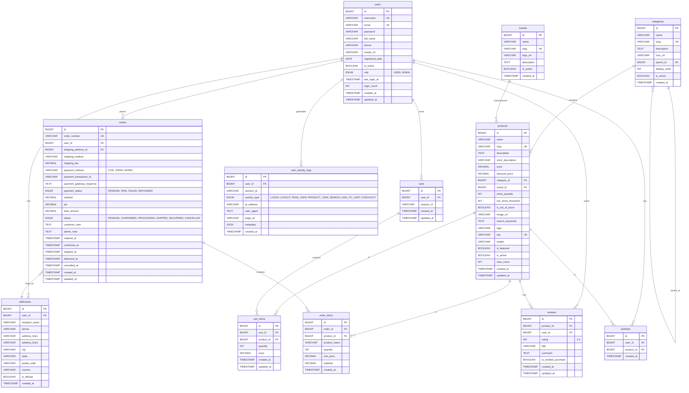

# Sơ Đồ ERD - Fat C Grocery Store Database

## Mermaid ERD Diagram

## Giải Thích Quan Hệ

### 1. Users (Trung Tâm)
- **1:N với addresses**: Một user có nhiều địa chỉ
- **1:N với carts**: Một user có nhiều giỏ hàng (session-based)
- **1:N với orders**: Một user đặt nhiều đơn hàng
- **1:N với reviews**: Một user viết nhiều đánh giá
- **1:N với wishlists**: Một user có nhiều sản phẩm yêu thích
- **1:N với user_activity_logs**: Một user tạo nhiều activity logs

### 2. Products (Sản Phẩm)
- **N:1 với categories**: Nhiều sản phẩm thuộc một danh mục
- **N:1 với brands**: Nhiều sản phẩm thuộc một thương hiệu
- **1:N với cart_items**: Một sản phẩm có thể trong nhiều giỏ hàng
- **1:N với order_items**: Một sản phẩm có thể trong nhiều đơn hàng
- **1:N với reviews**: Một sản phẩm có nhiều đánh giá
- **1:N với wishlists**: Một sản phẩm được nhiều user yêu thích

### 3. Categories (Danh Mục)
- **Self-referencing**: Danh mục có thể có danh mục cha (parent_id)
- **1:N với products**: Một danh mục chứa nhiều sản phẩm

### 4. Carts & Cart Items
- **1:N**: Một giỏ hàng chứa nhiều cart items
- **N:1**: Nhiều cart items tham chiếu đến một sản phẩm

### 5. Orders & Order Items
- **1:N**: Một đơn hàng chứa nhiều order items
- **N:1**: Đơn hàng giao đến một địa chỉ cụ thể
- **N:1**: Nhiều order items tham chiếu đến một sản phẩm

### 6. Reviews
- **N:1 với products**: Nhiều reviews cho một sản phẩm
- **N:1 với users**: Nhiều reviews từ một user
- **Unique constraint**: Một user chỉ review một sản phẩm một lần

### 7. Wishlists
- **N:1 với users**: Nhiều wishlist items thuộc một user
- **N:1 với products**: Nhiều wishlist items tham chiếu đến một sản phẩm
- **Unique constraint**: Một user chỉ thêm một sản phẩm vào wishlist một lần

### 8. User Activity Logs
- **N:1 với users**: Nhiều logs từ một user
- Lưu trữ tất cả hoạt động: login, page view, product view, search, etc.

## Thống Kê Database

- **Tổng số bảng**: 13
- **Bảng core**: users, products, orders
- **Bảng quan hệ**: cart_items, order_items, reviews, wishlists
- **Bảng hỗ trợ**: addresses, categories, brands, carts, user_activity_logs
- **Foreign Keys**: 20 quan hệ
- **Unique Constraints**: 8 (username, email, slug, sku, order_number, etc.)
- **Indexes**: 35+ indexes để tối ưu queries

## Đặc Điểm Thiết Kế

### ✅ Đã Tối Ưu
- Xóa bảng `payment_methods` (dùng payment gateway)
- Xóa bảng `product_variants` (sản phẩm đơn giản)
- Xóa bảng `banners` (không cần quản lý)
- Xóa bảng `product_images` (merge vào products)
- Xóa cột `theme_preference` (chỉ frontend)

### 🔒 Bảo Mật
- Password được hash (BCrypt)
- Soft delete với `is_active`
- Cascade delete cho dữ liệu phụ thuộc
- Restrict delete cho dữ liệu quan trọng (orders)

### 📊 Performance
- FULLTEXT index cho search
- Composite indexes cho queries phổ biến
- Indexes cho foreign keys
- Indexes cho date ranges (created_at, ordered_at)

### 🔄 Audit Trail
- `created_at` và `updated_at` cho tất cả bảng
- `user_activity_logs` cho traffic monitoring
- Order timestamps (ordered_at, confirmed_at, shipped_at, delivered_at)

---

**Tạo ngày**: 19 Tháng 1, 2026  
**Phiên bản**: 1.0  
**Tổng số bảng**: 13
